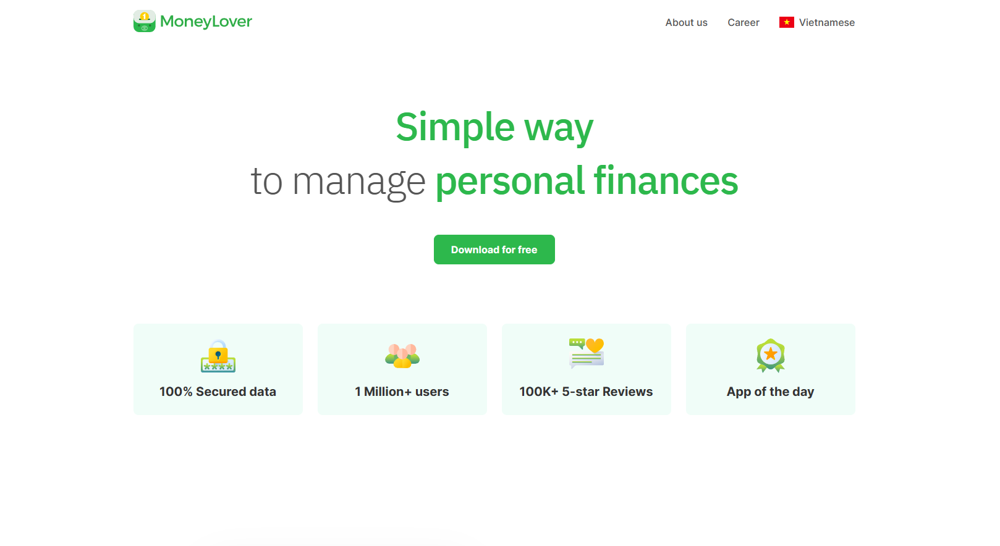
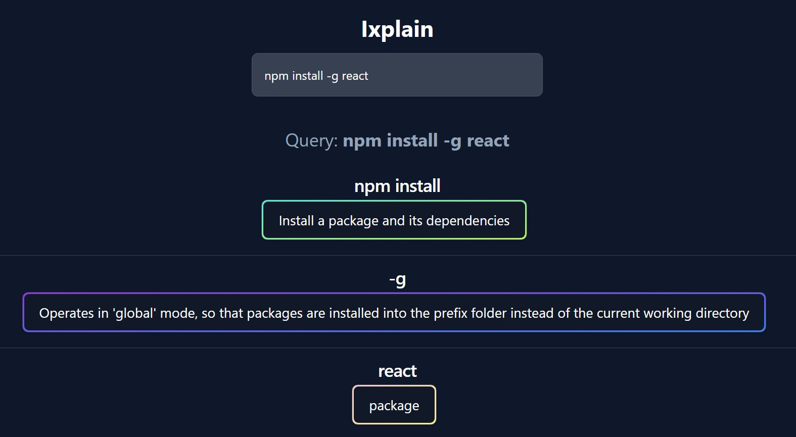

# HGB

### _`Software Engineer`_ | _`Tech Enthusiast`_ | _`Lifelong Learner`_

I’m **Bach**, a seasoned software engineer currently navigating the dynamic landscape of my career with an enduring passion for continuous learning. Unyielding in my pursuit of excellence, I adhere to the belief that determination and diligence are paramount in achieving success in the ever-evolving realm of software engineering. Throughout my journey, I have honed my skills and embraced challenges as opportunities for growth. As I continue to progress in my career, my commitment to improvement remains unwavering, and I aspire to inspire others to embark on their own journey of perpetual development..

---

## 🧰 Languages and Tools

---

## 👨‍💻 Some things I have worked on!

 
 
 
 
 

 
 

---

## 📊 Statistics

     
     
     <!--  -->

<!--
**radna0/radna0** is a ✨ _special_ ✨ repository because its `README.md` (this file) appears on your GitHub profile.

Here are some ideas to get you started:

- 📫 How to reach me: ...
- ⚡ Fun fact: ...
-->
