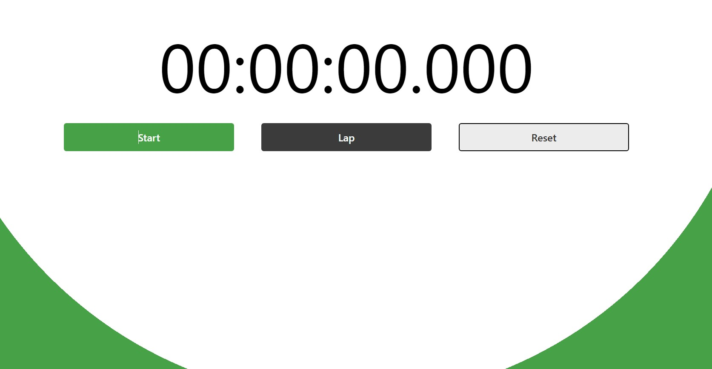

# 🔥 Bach Hoang Gia

### *`Software Engineer`* | *`Tech Enthusiast`* | *`Learner`* 
I’m **Bach**, an aspiring software engineer in the early stages of my career with a passion for learning. Under no circumstances will I give up on what I desire and relentlessly working to succeed is my motto, I believe that determination and diligence are key to achieving success in the field of software engineering. I am always striving to improve and grow as an engineer, and I hope to inspire others to do the same.

---

## 🧰 Languages and Tools

---

     

---

## 👨‍💻 Some of the things I have worked on!

 
 
 
 
 
 
 

<!--
**radna0/radna0** is a ✨ _special_ ✨ repository because its `README.md` (this file) appears on your GitHub profile.

Here are some ideas to get you started:

- 🔭 I’m currently working on ...
- 🌱 I’m currently learning ...
- 👯 I’m looking to collaborate on ...
- 🤔 I’m looking for help with ...
- 💬 Ask me about ...
- 📫 How to reach me: ...
- 😄 Pronouns: ...
- ⚡ Fun fact: ...
-->
